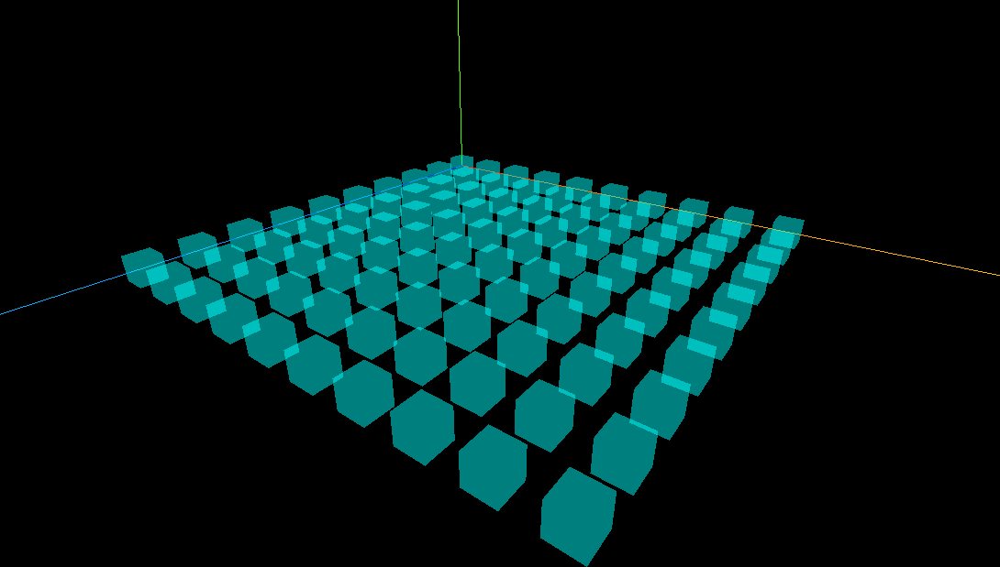

# 🔦 光源作用原理讲解


光源大体有四种类型，点光源，环境光，平行光和聚光灯光源。

## 点光源

#### **✅ 概念：**

模拟灯泡或火把等点状光源，从一点向四周发散。

#### **✅ 特点：**

- 位置决定光源中心。
- 会随距离衰减（受 distance 和 decay 控制）。
- 越远强度越小。

```JS
pointLight.intensity = 3.0
pointLight.decay = 0.1
pointLight.position.set(400, 200, 300)
```

这个光源位于空间中一点，它照向所有方向，靠近模型时能明显看到局部的亮处。

### 点光源辅助观察

通过点光源辅助观察对象PointLightHelper可视化点光源。 

```typescript
// 创建一个辅助光源对象
const pointlighthelper = new THREE.PointLightHelper(pointLight, 10)
scene.add(pointlighthelper)

```


## 环境光

#### **✅ 概念：**

模拟环境中的散射光（如天空光、反弹光），是无方向的光照，照亮场景中的每个角落。

#### **✅ 特点：**

- 不产生阴影。
- 不考虑方向和位置。
- 主要用于“填光”，防止未被其他光照到的地方完全黑暗。

```typescript
const ambientLight = new THREE.AmbientLight(0xffffff, 0.5)
```

提供基础照明，防止模型背光面全黑。


环境光是均匀且没有方向的，它会在物体上均匀地发亮。


## 平行光

#### **✅ 概念：**

模拟来自无限远的光，如阳光。所有光线方向一致，不考虑距离衰减。

#### **✅ 特点：**

- 适合大范围均匀照明。
- 光照方向由 .position 与 .target 决定，而不是 position 本身。
- 没有 distance 和 decay 参数。

#### ✅ 你代码中的用法：

```typescript
directionalLight.position.set(80, 100, 50)
directionalLight.target = mesh
```

代表“阳光从 (80,100,50) 的方向照向 mesh 模型”。


## **📐 图示讲解：光线入射角与反射规律（结合漫反射）**

你提供的图中，解释了两种反射模型：


### 🌫️ 漫反射（图左）Diffuse Reflection

- **入射光**（蓝色箭头）照射到表面。
- 与法线构成 **入射角 θ**。
- **漫反射**不会朝一个方向反射，而是**沿着法线方向在半球面内均匀反射**。
- **入射角越小（光越垂直照射表面）→ 表面越亮。**

在 Three.js 中，MeshLambertMaterial 模拟的正是**漫反射**：

```typescript
const material = new THREE.MeshLambertMaterial({ color: 0x00ffff })
```

所以，**物体表面朝向光线越正，亮度越高；越偏离光源方向，越暗。**

### 🔄 镜面反射（图右）Specular Reflection

- 典型于镜面、金属表面。
- 反射角 = 入射角，能看到明确的高光。
- 在 Three.js 中由 MeshPhongMaterial 模拟。


## **✅ 总结对应关系**


| **光源类型** | **模拟场景** | **会衰减** | **会投影** | **常配合材质**     |
| ------------ | ------------ | ---------- | ---------- | ------------------ |
| AmbientLight | 环境反弹光   | ❌          | ❌          | 所有光照材质       |
| PointLight   | 灯泡/手电    | ✅          | ✅          | MeshLambert, Phong |
| Directional  | 阳光         | ❌          | ✅          | MeshLambert, Phong |


# 动画循环渲染

requestAnimationFrame() 是浏览器提供的一个 **动画刷新函数**，它的作用是告诉浏览器：“请你在**下次重绘之前**调用我提供的这个函数”。

不断地刷新画面（例如更新模型、摄像机视角、动画等），达到 **流畅实时渲染** 的效果。

在你代码中的这句：

```js
function render() {
  requestAnimationFrame(render);   // 递归地请求下一帧
  renderer.render(scene, camera);  // 执行一帧的渲染
}
```

表示每当浏览器准备好要渲染下一帧的时候，就会自动再次调用 render()，形成一个**循环动画帧渲染机制**。

### **✅ 相比** setInterval的优势

| **特性** | requestAnimationFrame()            | setInterval()            |
| -------- | ---------------------------------- | ------------------------ |
| 帧率控制 | 自动同步浏览器刷新率（通常 60fps） | 固定时间，不与浏览器同步 |
| 节能性   | 页面不在前台时会暂停，省电省资源   | 页面在后台也继续运行     |
| 平滑动画 | 是浏览器原生的动画渲染推荐方式     | 容易卡顿/撕裂            |

你可以把 requestAnimationFrame(render) 想象成：

> “浏览器啊，我想在每一帧都自动执行这个 render() 函数，来渲染场景动画，直到你说停。”

它是 Three.js 中动画循环、交互实时更新、摄像机控制等功能的**基础机制**。几乎所有 Three.js 的项目都会用它来驱动主渲染循环。

```js
// 创建一个时钟对象
const clock = new THREE.Clock()
function render() {
  // 获取时间间隔,使用毫秒作为单位
  const spt = clock.getDelta() * 1000
  // 获取时间间隔
  console.log('spt', spt);
  // 获取帧率
  console.log('渲染帧率', 1000 / spt);


  requestAnimationFrame(render)
  // 周期性旋转，每次旋转0.01个弧度
  mesh.rotateY(0.01)
  // 周期性执行渲染功能，更新canvas画布上的内容
  renderer.render(scene, camera)
}
render()
```

## canvas画布宽高动态变化

canvas画布宽高动态变化，需要动态更新相机和渲染的参数，否则无法重新渲染。

```js
// onresize事件会在窗口被调整大小时发生
window.onresize = function () {
  // 重置渲染器输出画布canvas尺寸
  renderer.setSize(window.innerWidth, window.innerHeight)
  // 全屏状况下:设置观察范围长宽比aspect为窗口宽高比
  camera.aspect = window.innerWidth / window.innerHeight
  // 渲染器执行render方法的时候，会读取相机对象的投影矩阵属性
  // 但是不会每渲染一帧就通过相机的属性计算投影矩阵(节约计算资源)
  // 如果相机的一些属性发生了变化，需要执行updateprojectionmatrix方法更新投影矩阵
  camera.updateProjectionMatrix()
}
```

这段代码是为了处理 **浏览器窗口大小发生变化时的响应更新逻辑**，也就是让你的 Three.js 场景在全屏、自适应窗口时仍然保持正确的比例和尺寸，不会变形或拉伸。

```js
  renderer.setSize(window.innerWidth, window.innerHeight)
```

- 重新设置 Three.js 渲染器（底层的 canvas）的尺寸，适配当前窗口的新宽度和高度。
- renderer.setSize() 会调整 canvas 元素的尺寸，从而确保图像不会拉伸或模糊。

```js
  camera.aspect = window.innerWidth / window.innerHeight
```

- 修改相机的 aspect（宽高比），它是透视投影中很重要的参数。
- 如果你不更新这个值，相机会继续以旧的宽高比进行渲染，导致画面变形（比如拉长或压扁）。

```js
  camera.updateProjectionMatrix()
```

- 这一句是关键！
- 虽然你更改了 camera.aspect，**但 Three.js 不会立刻帮你重新计算投影矩阵**（为了优化性能）。
- 所以你要手动调用 .updateProjectionMatrix()，告诉 Three.js 现在相机属性变了，需要刷新它的投影矩阵。


### **🎯 总结一行话**


> 这段代码是为了**在窗口尺寸变化时，保持 canvas 和相机投影比例同步**，从而保证渲染内容不变形，是 Three.js 自适应窗口的标准写法。


## Stats的使用

```js
// 创建Stats对象
const stats = new Stats()
// stats.domElement:web页面上输出计算结果,一个div元素，
document.body.appendChild(stats.domElement)
// 渲染函数
function render() {
  // requestAnimationframe循环调用的函数中调用update()来刷新时间
  stats.update()
  // 执行渲染操作
  renderer.render(scene, camera)
  // 请求再次执行渲染函数render，渲染下一帧
  requestAnimationFrame(render)
}
render()
```

这段代码的作用是：**在网页上实时显示当前的渲染性能（如帧率 FPS）并不断刷新场景画面**，它使用了 stats.js 性能监视器配合 requestAnimationFrame() 实现动画循环渲染。

### **🔧 核心功能概述**

- 使用 Stats 创建一个性能监控器实例，它会在页面上显示一个小面板（通常位于左上角），展示当前帧率（FPS）、渲染时间等信息。

- 把 stats.domElement（其实是一个 <div> 元素）添加到网页上，这样就能看到性能面板。

- 定义一个 render() 函数，这就是主渲染循环：

  

  - 每一帧调用 stats.update() 来刷新性能数据；
  - 然后用 renderer.render(scene, camera) 把当前的 3D 场景画到 canvas 上；
  - 最后用 requestAnimationFrame(render) 注册下一帧的执行，从而形成**无限循环**，大概每秒执行 60 次（与浏览器刷新率同步）。

### **✅ 总结一句话**

这段代码实现了一个 **实时动画循环 + 性能监控** 的渲染系统，它每一帧都会：

> 更新性能面板 → 渲染场景 → 请求下一帧 → 周而复始。

这是开发 Three.js 应用时非常常见的一种结构，便于调试性能和持续更新画面。


## 相机视角切换

```js
import * as THREE from 'three';
import { OrbitControls } from 'three/examples/jsm/controls/OrbitControls.js'; 

const scene=new THREE.Scene()

const geometry=new THREE.BoxGeometry(100,100,100)

const material=new THREE.MeshLambertMaterial({
  color:0x00ffff,
  transparent:true,
  opacity:0.5
})

for (let i = 0; i < 10; i++) {
  
for(let j=0;j<10;j++){

  const mesh=new THREE.Mesh(geometry,material)
  // 在XOZ平面分布
mesh.position.set(i*200,0,j*200)
  scene.add(mesh)
}
}
// 参数分别代表光源颜色，光源强度，光源位置，光源方向
const light=new THREE.DirectionalLight(0xffffff,500)
light.position.set(100,100,100)

scene.add(light)

const axesHelper = new THREE.AxesHelper(3000)
scene.add(axesHelper)


const camera=new THREE.PerspectiveCamera(75,window.innerWidth/window.innerHeight,0.1,8000)

camera.position.set(300,400,500)
camera.lookAt(1000,0,1000)

const renderer=new THREE.WebGLRenderer()

renderer.setSize(window.innerWidth,window.innerHeight)


const controls=new OrbitControls(camera,renderer.domElement)
controls.target.set(1000,0,1000)
controls.update()
function render(){
requestAnimationFrame(render)
  renderer.render(scene,camera)
}

render()

document.body.appendChild(renderer.domElement) //将渲染器添加到body中

// onresize事件会在窗口被调整大小时发生
window.onresize = function () {
  // 重置渲染器输出画布canvas尺寸
  renderer.setSize(window.innerWidth, window.innerHeight)
  // 全屏状况下:设置观察范围长宽比aspect为窗口宽高比
  camera.aspect = window.innerWidth / window.innerHeight
  // 渲染器执行render方法的时候，会读取相机对象的投影矩阵属性
  // 但是不会每渲染一帧就通过相机的属性计算投影矩阵(节约计算资源)
  // 如果相机的一些属性发生了变化，需要执行updateprojectionmatrix方法更新投影矩阵
  camera.updateProjectionMatrix()
}


```

如果你使用了camera.lookAt切换了视角，受到相机滑轨控制器的影响，我们必须同步修改controls的目标位置，确保同步指向对应的视角。

另外一定需要在执行控制器的点位设置后，再次更新controls来确保同步更新视角和位置。


# 光照角度分析




为什么从这个角度(1000,1000,1000)看，所有的立方体侧面都可以看到受光呢？

## **1. 光源方向分析**

您在代码中这样设置了平行光：

```JavaScript
const light = new THREE.DirectionalLight(0xffffff, 500);
light.position.set(100, 100, 100);
scene.add(light);
```

`DirectionalLight`（平行光）的 `position` 属性实际上是用来定义光线方向的。默认情况下，平行光会从其 `position` 指向场景的**原点 `(0,0,0)`** (即 `light.target.position` 的默认值)。

所以，您的光线方向是：

- 光源位置 (L)：`(100, 100, 100)`
- 目标位置 (T)：`(0, 0, 0)`
- 光线方向向量 (D) = T - L = `(0-100, 0-100, 0-100)` = `(-100, -100, -100)`

这个方向向量 `(-100, -100, -100)` 表明光线是从场景中 X、Y、Z 轴都为正值的区域，斜向 X、Y、Z 轴都为负值的区域照射。简单来说，光线大致沿着 `(-1, -1, -1)` 的方向传播，即从您的场景的“右后上方”（相对于坐标轴正方向）斜向“左前下方”。

## **2. 相机视角分析**

您的相机设置是：

```JavaScript
camera.position.set(300, 400, 500);
camera.lookAt(1000, 0, 1000);
// 以及 OrbitControls 的 target 也同步设置
controls.target.set(1000, 0, 1000);
```

- 相机位置：`(300, 400, 500)`
- 观察目标：`(1000, 0, 1000)`

立方体网格分布在 XOZ 平面上，X 和 Z 坐标从 0 延伸到 `9*200 = 1800`。 您的相机位于 `(300,400,500)`，看向 `(1000,0,1000)`。这意味着：

- 相机在 X 轴方向上，是从较小值 (300) 看向较大值 (1000)。
- 相机在 Z 轴方向上，是从较小值 (500) 看向较大值 (1000)。
- 相机在 Y 轴方向上，是从较高处 (400) 看向较低处 (0)。

因此，从这个视角，您主要能看到立方体的：

- **顶面** (朝向 +Y 方向)
- 朝向 **X 轴正方向**的侧面 (可称为“右侧面”)
- 朝向 **Z 轴正方向**的侧面 (可称为“后侧面”，即远离坐标原点，朝向 Z 轴正向的那个面)

### 相机控制器视角同步

OrbitControls 在 Three.js 中用于控制相机围绕一个目标点进行轨道、平移和缩放操作。它内部维护了一个 target 属性，这个 target 就是相机观察和围绕旋转的中心点。

当你创建一个 OrbitControls 实例时，它会接管相机的变换（位置和朝向）。

1. camera.lookAt(1000, 0, 1000): 这个方法直接设置相机朝向世界坐标中的点 (1000, 0, 1000)。它会改变相机的内部旋转（四元数 quaternion）。
2. controls.target.set(1000, 0, 1000):

- OrbitControls 有其自己的目标点概念。默认情况下，这个目标点是 (0,0,0)。

- 如果你只调用 camera.lookAt() 而不设置 controls.target，那么 OrbitControls 仍然认为它的目标是 (0,0,0)（或者它之前的某个目标）。

- 当你与场景交互（例如拖动鼠标旋转）或者 OrbitControls 被更新时，它会尝试根据 *它自己* 的 target 来重新定位和定向相机。这就会导致 camera.lookAt() 的设置被覆盖或产生冲突。

- 通过 controls.target.set(1000, 0, 1000)，你明确告诉 OrbitControls，相机应该围绕 (1000, 0, 1000) 这个点进行观察和操作。这样就统一了相机的观察点和控制器的目标点。

3. controls.update():

- **这个方法是必须的，用于在对 OrbitControls 的属性（如 target）或相机本身的变换进行手动更改后，更新控制器的状态，并根据这些状态重新计算相机的位置和朝向。**

- 当你设置了 controls.target 之后，调用 controls.update() 会确保相机根据新的目标点以及当前的轨道参数（如距离、方位角、极角）正确地更新其姿态。

总结来说：

- camera.lookAt() 是对相机本身的直接指令。

- OrbitControls 为了实现交互式控制，引入了自己的 target 概念。

- 为了让 OrbitControls 和 camera.lookAt() 的意图一致，你需要将 OrbitControls 的 target 设置为与 camera.lookAt() 相同的点。

- controls.update() 是在这些更改之后，让 OrbitControls 应用这些设置并更新相机状态的关键步骤。

如果你不设置 controls.target 并调用 controls.update()，那么 OrbitControls 在其下一次更新时（例如在 render 函数的 requestAnimationFrame 循环中，或者用户交互时），可能会根据其内部的、未被同步的 target 来调整相机，从而使 camera.lookAt() 的效果失效或不符合预期。

## **3. 立方体受光面分析**

一个标准的立方体有六个面，它们的法向量（垂直于表面的向量）分别指向：

- 顶面: `(0, 1, 0)`
- 底面: `(0, -1, 0)`
- 右侧面 (+X): `(1, 0, 0)`
- 左侧面 (-X): `(-1, 0, 0)`
- 后侧面 (+Z): `(0, 0, 1)`
- 前侧面 (-Z): `(0, 0, -1)`

**光线方向向量 D≈(−0.577,−0.577,−0.577) (单位化后的 `(-1,-1,-1)` )。**

**一个表面会受光，如果其法向量 N 与光线入射方向的反方向 −D 的点积大于 0 (即 N⋅(−D)>0)。**

让我们检查一下：

- **顶面** (法向量 N=(0,1,0)): N⋅(−D)=(0,1,0)⋅(0.577,0.577,0.577)=0.577>0。**顶面受光。**
- **右侧面 (+X)** (法向量 N=(1,0,0)): N⋅(−D)=(1,0,0)⋅(0.577,0.577,0.577)=0.577>0。**右侧面 (+X) 受光。**
- **后侧面 (+Z)** (法向量 N=(0,0,1)): N⋅(−D)=(0,0,1)⋅(0.577,0.577,0.577)=0.577>0。**后侧面 (+Z) 受光。**
- 左侧面 (-X) (法向量 N=(−1,0,0)): N⋅(−D)=(−1,0,0)⋅(0.577,0.577,0.577)=−0.577<0。此面不受此直接光照。
- 前侧面 (-Z) (法向量 N=(0,0,−1)): N⋅(−D)=(0,0,−1)⋅(0.577,0.577,0.577)=−0.577<0。此面不受此直接光照。
- 底面 (法向量 N=(0,−1,0)): N⋅(−D)=(0,−1,0)⋅(0.577,0.577,0.577)=−0.577<0。此面不受此直接光照。

### **结论**

根据上面的分析：

1. 您的光源方向是从大致的 `(1,1,1)` 方向指向 `(0,0,0)`，所以光线带有 `(-X, -Y, -Z)` 的分量。
2. 您的相机视角使得您能看到立方体的顶面、朝向 `+X` 的侧面以及朝向 `+Z` 的侧面。
3. 计算表明，这三个面（顶面、+X侧面、+Z侧面）确实都会被您设置的平行光照亮。

因此，您在图片中观察到所有可见的立方体侧面（以及顶面）都受光，是完全符合预期的。并非立方体的所有6个面都受光，而是从您当前的相机角度看过去，那些恰好能被您看到，并且法向量与光线能形成合适角度的侧面都受到了光照。

如果您想让其他侧面受光，您需要改变光源的 `position` (从而改变光照方向) 或者旋转立方体。


# 网格材质类型

下面是三种常用材质的对比，参照上一问的组织形式：

| 特性                      | MeshBasicMaterial           | MeshLambertMaterial                        | MeshPhongMaterial                            |
| ------------------------- | --------------------------- | ------------------------------------------ | -------------------------------------------- |
| **是否响应光照**          | 否                          | 是（仅漫反射）                             | 是（漫反射 + 镜面高光）                      |
| **光照模型**              | —                           | Lambert 漫反射模型                         | Phong 漫反射 + Phong 镜面高光模型            |
| **支持高光（Specular）**  | 否                          | 否                                         | 是                                           |
| **环境光影响（Ambient）** | 否                          | 通过 `emissive` 简单模拟                   | 支持 `ambient` + `emissive`                  |
| **性能开销**              | 最低                        | 较低                                       | 较高                                         |
| **常用参数**              | `color`、`map`、`wireframe` | `color`、`emissive`、`side`、`flatShading` | `color`、`emissive`、`specular`、`shininess` |
| **典型使用场景**          | 调试辅助、2D 精灵、UI 元素  | 需要基础光照且追求性能的几何体             | 需要高光效果或金属感的物体                   |


------

## 原理对比

1. **MeshBasicMaterial**
   - **无光照**：不参与任何光照计算，直接输出 `color` 或纹理贴图像素值。
   - **渲染流程**：顶点→片元不做光照运算 → 输出颜色。
   - **优势**：渲染速度最快，适合不需要光照或纯色/贴图的场景。
2. **MeshLambertMaterial**
   - **漫反射**：根据法线和光照方向计算 `N·L`，得出面向光源程度。
   - **自发光**：可用 `emissive` 参数在阴影区域添加基础亮度，避免全黑。
   - **阴影过渡**：产生柔和的明暗渐变，模拟粗糙表面。
3. **MeshPhongMaterial**
   - **漫反射 + 镜面高光**：在 Lambert 漫反射基础上增加 Phong 镜面项，计算 `R·V`（反射向量与视线向量点乘）的高次幂。
   - **高光参数**：
     - `specular`：高光颜色
     - `shininess`：高光散射系数（数值越大，高光越集中）
   - **环境光支持**：同样可用 `emissive`，在光照不足时保留背景亮度。

------

## 效果对比

- **MeshBasicMaterial**
  - 颜色恒定，无明暗变化。
  - 适合背景网格、HUD、平面化界面元素。
- **MeshLambertMaterial**
  - 光源方向决定亮面与暗面，朴素的阴影过渡。
  - 适合地面、植物、布料等粗糙材质表现。
- **MeshPhongMaterial**
  - 除漫反射外有高光点，表现金属、塑料、抛光表面。
  - 更立体、更闪亮，但相对性能开销大。

### 代码示例

```js
// Basic
const basicMat = new THREE.MeshBasicMaterial({
  color: 0x2194ce,
  wireframe: false
});

// Lambert
const lambertMat = new THREE.MeshLambertMaterial({
  color: 0x88cc44,
  emissive: 0x222222,
  flatShading: false
});
scene.add(new THREE.DirectionalLight(0xffffff, 1));

// Phong
const phongMat = new THREE.MeshPhongMaterial({
  color: 0xffaa00,
  specular: 0x555555,
  shininess: 30,
  emissive: 0x111111
});
scene.add(new THREE.PointLight(0xffffff, 0.8, 2000));
```

选择哪种材质，取决于对光照效果和性能的平衡需求：

- **追求速度 & 固定色** → Basic
- **需要简单光照 & 高性能** → Lambert
- **追求立体高光 & 真实感** → Phong


## 高光反射材质

### emissive

在 Three.js 的材质（如 `MeshLambertMaterial`、`MeshPhongMaterial`、`MeshStandardMaterial` 等）中，**`emissive`** 表示“自发光颜色”（Emissive Color）。它的作用和含义可以这样理解：

1. **自发光**
   - `emissive` 定义了材质本身“发光”的颜色，无论场景中有没有光源，这部分颜色都会被直接叠加到最终像素上。
   - 可以把它想象成物体在黑暗中自己发出的微弱光。
2. **不受光照影响**
   - 与 `color` 不同，`emissive` 不会被场景内的光源方向、强度、阴影等因素改变。
   - 即使所有光都关闭，`emissive` 依然可见。
3. **增强暗部细节**
   - 在使用漫反射或镜面光模型时，背光面／阴影面往往会变得很暗，甚至接近黑色。
   - 通过给阴影面加一点 `emissive`，可以避免完全黑掉，保留一些可辨识的细节。
4. **表现发光物体**
   - 可以用来模拟诸如显示屏、霓虹灯、火焰等始终发光的表面。
   - 如果需要让物体在渲染后还“发散”光晕，通常还要配合后处理（Bloom）效果。

#### 使用示例

```js
// 漫反射材质 + 自发光
const lambertMat = new THREE.MeshLambertMaterial({
  color: 0x4488aa,
  emissive: 0x222222,    // 阴影里也有一点颜色
  emissiveIntensity: 0.5 // (可选) 控制 self-color 的强度
});

// 镜面光材质 + 强自发光
const phongMat = new THREE.MeshPhongMaterial({
  color: 0xffcc00,
  emissive: 0xff5500,     // 橙红色的自发光
  emissiveIntensity: 1.0, // 默认值 1.0
  specular: 0x555555,
  shininess: 30
});
```

- `emissive` 接受的是一个 16 进制颜色值（`0xRRGGBB`）。
- `emissiveIntensity`（可选，默认 `1`）可以单独调节自发光颜色的强度，等同于把 `emissive` 颜色再乘以一个系数。

------

#### 效果总结

| 面向光源区域                              | 阴影／背光区域                               |
| ----------------------------------------- | -------------------------------------------- |
| 会显示 `color` + 漫反射/高光 + `emissive` | 会显示 `emissive`（因为漫反射/高光几乎为 0） |


通过合理设置 `emissive`，你可以在保留材质光照效果的同时，控制阴影细节或制造自发光效果。


### 高光

高亮拥有亮度属性和颜色属性两种特性。

```js
const material=new THREE.MeshPhongMaterial({
  color:0xff0000,
  // 高光强度属性
  shininess:200
// 高光颜色属性
// specular:0x0000ff,

})
```

