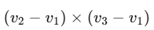
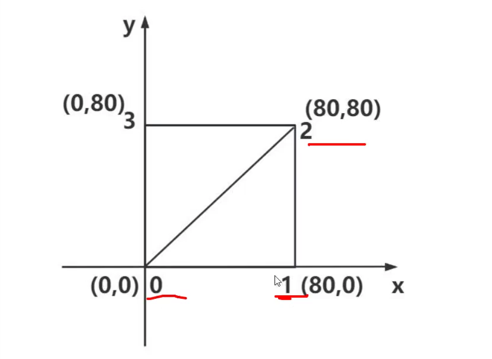
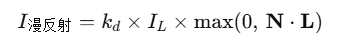

# 缓冲类型几何体（BufferGeometry）详解

在早期的 Three.js 中，几何体（Geometry）通常采用面向对象的方式存储顶点、面和法线等数据，使用起来直观易懂，但性能和内存消耗较高。为了满足现代 WebGL 的高性能需求，Three.js 后来引入了 **缓冲类型几何体（BufferGeometry）**，它使用底层的 Typed Arrays（`Float32Array`、`Uint16Array` 等）来存储顶点属性，极大地提高了渲染性能，并减少了内存占用。下面从多个维度来讲解 BufferGeometry 的原理与用法。

---

## 1. 什么是 BufferGeometry？

- **BufferGeometry** 是 Three.js 中最底层的一种几何体表示方式。  
- 它把与几何体相关的数据（顶点位置、法线、UV、颜色、索引等）全部以“扁平化”的方式存储在类型化数组（Typed Array）里，例如：
  - `position` 属性：`Float32Array([ x0, y0, z0,   x1, y1, z1,   x2, y2, z2, ... ])`  
  - `normal` 属性：`Float32Array([ nx0, ny0, nz0, ... ])`  
  - `uv` 属性：`Float32Array([ u0, v0,  u1, v1,  ... ])`  
  - `index` 属性（可选）：`Uint16Array([ i0, i1, i2,  i3, i4, i5, ... ])`  

- 每个属性会被包装成一个 `THREE.BufferAttribute` 或者 `THREE.InterleavedBufferAttribute`，并挂到 `geometry.attributes` 或 `geometry.index` 上。

---

## 2. 为什么要使用 BufferGeometry？

1. **性能更高**  
   - WebGL 底层接口（GLSL、着色器）需要接收扁平化的内存块（Buffer）。  
   - BufferGeometry 把顶点数据直接以 `Float32Array` 的形式上传到 GPU，无需在每帧或多次调用时构建临时数据结构，减少 CPU 与 GPU 之间的拷贝开销。

2. **减少内存占用**  
   - 早期的 `Geometry` 会为每个顶点创建 JS 对象（`Vector3`），并维护额外的面索引、法线、UV 等数组。  
   - BufferGeometry 直接使用连续的底层数组，避免了大量 JS 对象和垃圾回收带来的性能瓶颈。

3. **更灵活**  
   - 可以自由地在一个几何体里组合、修改任意属性，比如动态更新某一区域的顶点位置，只需修改 `Float32Array` 中的一小部分数据，然后调用 `attribute.needsUpdate = true` 即可。  
   - 支持索引（`index`），让相邻的多个三角形共享顶点，节省内存并提高顶点缓存重用率。

---

## 3. BufferGeometry 的常见属性

```js
const geometry = new THREE.BufferGeometry();
```

### 3.1. position（必选）

- 类型：`BufferAttribute`

- 描述：存储顶点坐标，每 3 个连续元素表示一个顶点的 (x, y, z)。

- 例子：

  ```js
  // 3 个顶点：A(0,0,0)、B(1,0,0)、C(0,1,0)
  const vertices = new Float32Array([
    0, 0, 0,
    1, 0, 0,
    0, 1, 0
  ]);
  geometry.setAttribute('position', new THREE.BufferAttribute(vertices, 3));
  ```

### 3.2 BufferAttribute

```JS
import * as THREE from 'three'

// 创建一个空的几何体对象
const geometry=new THREE.BufferGeometry()

// 添加顶点数据

// 类型化数组定义的一组顶点坐标数据
const vertices=new Float32Array([
  // 数组里面编写顶点的坐标数据
0,0,0,
50,0,0,
0,100,0,
0,0,10,
0,0,100,
50,0,10
])

// 将顶点数据添加到几何体对象中
geometry.setAttribute('position',new THREE.BufferAttribute(vertices,3))

// 创建一个几何体对象
const mesh=new THREE.Mesh(geometry,new THREE.MeshBasicMaterial({color:0x00ff00}))

```

new THREE.BufferAttribute用于实现生成一个属性缓冲对象，用于表示顶点数据。

### 3.3. normal（可选，但在光照材质下通常需要）

- 类型：`BufferAttribute`

- 描述：存储顶点法线 (nx, ny, nz)，用于光照模型的计算。如果没有手动设置，可以调用 `geometry.computeVertexNormals()` 自动生成。

- 例子：

  ```js
  // 对上面三角形的顶点分别设置法线
  const normals = new Float32Array([
    0, 0, 1,
    0, 0, 1,
    0, 0, 1
  ]);
  geometry.setAttribute('normal', new THREE.BufferAttribute(normals, 3));
  ```

### 3.4. uv（可选，用于贴图）

- 类型：`BufferAttribute`

- 描述：存储纹理坐标 (u, v)，每 2 个元素代表一个顶点的纹理坐标。纹理映射时会读取它来决定如何对顶点进行采样。

- 例子：

  ```js
  // 对三角形顶点 A,B,C 分别设置 UV
  const uvs = new Float32Array([
    0, 0,
    1, 0,
    0, 1
  ]);
  geometry.setAttribute('uv', new THREE.BufferAttribute(uvs, 2));
  ```

### 3.5. color（可选，用于顶点着色）

- 类型：`BufferAttribute`

- 描述：存储顶点颜色 (r, g, b)，通过 `MeshBasicMaterial({ vertexColors: true })` 等开启顶点色功能时会用到。

- 例子：

  ```js
  const colors = new Float32Array([
    1, 0, 0,  // 顶点 A：红色
    0, 1, 0,  // 顶点 B：绿色
    0, 0, 1   // 顶点 C：蓝色
  ]);
  geometry.setAttribute('color', new THREE.BufferAttribute(colors, 3));
  ```

### 3.6. index（可选，用于索引绘制）

- 类型：`BufferAttribute`

- 描述：存储三角形面片的顶点索引，数组里的每 3 个整数代表一个三角形要使用的 3 个顶点编号（对应 position 数组里的顶点序号），能让多个三角形共享顶点。

- 例子：

  ```js
  // A(顶点0), B(顶点1), C(顶点2) 构成一个三角形
  const indices = new Uint16Array([ 0, 1, 2 ]);
  geometry.setIndex(new THREE.BufferAttribute(indices, 1));
  ```

------

## 4. 为什么要用索引（index）？

1. **顶点共享**
   - 如果有相邻的多个三角形共用同一个顶点，用索引就能让这些三角形在 position 数组里都引用同一个顶点坐标，而不用重复写入，减少显存占用。
2. **提高顶点缓存命中率**
   - 现代 GPU 有 “顶点缓存（Post-Transform Cache）”，在绘制时可以重用最近计算过的顶点。如果用索引，多个三角形共用同一个顶点，会触发缓存命中，让渲染更高效。
3. **灵活性**
   - 索引越少，顶点数据越紧凑。例如构建一个立方体，用索引方式只要 8 个顶点就能生成 12 个三角形；但如果不加索引，你得重复写 36 个顶点坐标（12 个三角形 × 3 个顶点）。

------

## 5. BufferGeometry vs. 旧版 Geometry

| 特性                 | Geometry（旧）                       | BufferGeometry（新）                                         |
| -------------------- | ------------------------------------ | ------------------------------------------------------------ |
| 存储方式             | JS 对象数组（`vertices: Vector3[]`） | 连续的 Typed Array（`Float32Array`、`Uint16Array`）          |
| 性能                 | 较低，构建/管理对象开销大            | 较高，直接上传 GPU 缓冲，减少 GC 开销                        |
| 支持索引绘制         | 只有部分几何体支持                   | 原生支持 `setIndex`，顶点可复用                              |
| 动态修改             | 方便，可直接操作 `vector3.x=...`     | 需要自己修改 Typed Array 中的值，然后设置 `needsUpdate=true` |
| 内存占用             | 较高                                 | 较低                                                         |
| 场景中模型数量较多时 | 性能容易瓶颈                         | 更适合大规模模型和粒子、点云渲染                             |


------

## 6. 如何创建一个自定义的 BufferGeometry？

下面示例展示了一个简单的三角形（没有索引）与一个带索引的正方形（两个三角形）的构造过程。

### 6.1. 简单三角形（无索引）

```js
// 1. 新建 BufferGeometry
const geometry = new THREE.BufferGeometry();

// 2. 定义三个顶点坐标
const vertices = new Float32Array([
  0, 0, 0,  // 顶点 0 (A)
  1, 0, 0,  // 顶点 1 (B)
  0, 1, 0   // 顶点 2 (C)
]);

// 3. 把顶点数组包装成 BufferAttribute，itemSize=3 表示每 3 个数为一组 (x,y,z)
geometry.setAttribute('position', new THREE.BufferAttribute(vertices, 3));

// 4. （可选）手动设置法线、UV、颜色
// geometry.setAttribute('normal', new THREE.BufferAttribute(normalsArray, 3));
// geometry.setAttribute('uv', new THREE.BufferAttribute(uvArray, 2));

// 5. 创建 Mesh 并添加到场景
const material = new THREE.MeshBasicMaterial({ color: 0xff0000 });
const triangle = new THREE.Mesh(geometry, material);
scene.add(triangle);
```

### 6.2. 带索引的正方形（两个三角形）

```js
// 1. 新建 BufferGeometry
const square = new THREE.BufferGeometry();

// 2. 定义四个顶点（顺序：A → B → C → D）
const vertices = new Float32Array([
  -1, -1, 0,  // 顶点 0 (A)
   1, -1, 0,  // 顶点 1 (B)
   1,  1, 0,  // 顶点 2 (C)
  -1,  1, 0   // 顶点 3 (D)
]);
square.setAttribute('position', new THREE.BufferAttribute(vertices, 3));

// 3. 定义索引数组，两个三角形：A-B-C 和 A-C-D
const indices = new Uint16Array([
  0, 1, 2,   // 三角形 ABC
  0, 2, 3    // 三角形 ACD
]);
square.setIndex(new THREE.BufferAttribute(indices, 1));

// 4. （可选）手动计算或自动生成法线，否则光照材质会渲染不正常
square.computeVertexNormals();

// 5. 创建材质并渲染
const mat = new THREE.MeshLambertMaterial({ color: 0x00ff00 });
const meshSquare = new THREE.Mesh(square, mat);
scene.add(meshSquare);
```

------

## 7. 动态修改 BufferGeometry

如果想在运行时修改某些顶点，比如让三角形的第一个顶点沿 X 轴移动 0.5 单位，可以这样操作：

```js
// 获取 position 属性对应的 BufferAttribute
const posAttr = geometry.getAttribute('position');

// 修改第 0 个顶点的 x 分量
posAttr.setX(0, posAttr.getX(0) + 0.5);

// 通知 Three.js 该属性已更新，需要重新上传到 GPU
posAttr.needsUpdate = true;

// 如果依赖法线，还需要重新计算法线
geometry.computeVertexNormals();
```

同理，还可以更新 `normal`、`uv`、`color` 等数组来动态改变几何体形状、贴图坐标或顶点颜色。

------

## 8. BufferGeometry 的其他高级用法

1. **InterleavedBufferAttribute**

   - 可以把多个属性（比如 position、normal、uv）交叉存放在一个更大的 `ArrayBuffer` 中，以提高数据利用率和缓存命中率。

   - 用法示例：

     ```js
     const array = new Float32Array([
       x0, y0, z0, nx0, ny0, nz0, u0, v0,
       x1, y1, z1, nx1, ny1, nz1, u1, v1,
       ...
     ]);
     const interleaved = new THREE.InterleavedBuffer(array, 8); // 每 8 个数为一组
     geometry.setAttribute('position', new THREE.InterleavedBufferAttribute(interleaved, 3, 0)); // 偏移 0
     geometry.setAttribute('normal',   new THREE.InterleavedBufferAttribute(interleaved, 3, 3)); // 偏移 3
     geometry.setAttribute('uv',       new THREE.InterleavedBufferAttribute(interleaved, 2, 6)); // 偏移 6
     ```

2. **BufferGeometryUtils 合并几何体**

   - 当你有大量小几何体时，分别上传会有开销，可用 `BufferGeometryUtils.mergeBufferGeometries([...])` 把它们合并到一个大几何体，提高渲染批次效率。

3. **DrawRange**

   - 通过 `geometry.setDrawRange(start, count)` 可以让你只渲染索引数组中的一部分。例如，做粒子系统时候把一半索引渲染，一半动态切换到背后再渲染等。

4. **InstancedMesh**

   - 如果要渲染大量相同几何体（比如 1,000 个立方体），可以用 `THREE.InstancedMesh(geometry, material, count)`，再通过 `mesh.setMatrixAt(i, matrix)` 动态设置每个实例的变换矩阵，大幅提高性能。

------

## 9. 小结与最佳实践

- **通常使用 BufferGeometry**
  - 除非你在非常简单的场景里手动构建几何体，否则大部分 Three.js 内置几何类型（如 `BoxGeometry`、`SphereGeometry`）其实已经继承自 `BufferGeometry`。
  - 尽量避免使用已弃用的 `Geometry`，因为它会在未来的版本中完全移除。
- **准备好索引**
  - 对于大于 3 顶点的几何体，务必使用 `setIndex` 将索引缓冲设置好，这样可共享顶点并提高渲染效率。
- **动态更新时注意 `needsUpdate`**
  - 每当修改了某个 `BufferAttribute`（如 `position` 或 `normal`）的元素，一定要把 `attribute.needsUpdate = true`，让 Three.js 重新上传到 GPU，否则不会生效。
- **合理设置 DrawRange、使用 Instancing**
  - 对于需要局部更新或大量重复物体的场景，可使用 `setDrawRange`、`InstancedMesh` 等特性，最大化利用 GPU 渲染性能。


# 网格模型的特性

## 1. 三角形的顺时针和逆时针：反面/正面的可见性

### （1）面朝向（Front Face）与背面朝向（Back Face）

在三维渲染里，每个三角形有两个面：  
- **正面（Front Face）**：渲染时默认“可见”且参与光照计算。  
- **背面（Back Face）**：默认“不可见”且通常会被剔除（Back‐face Culling），以节省性能。

### （2）顶点顺序与面朝向

- 渲染管线会根据三角形**顶点在屏幕空间中的投影**来判断是“顺时针”还是“逆时针”：
  - **逆时针（CCW, Counter‐Clockwise）**：Three.js 默认把它当作**正面**。  
  - **顺时针（CW, Clock‐Wise）**：默认当作**背面**，会被剔除。

  举例：在屏幕上把三角形的三个顶点标为 A、B、C，如果从 A → B → C 连线画出的方向是**逆时针**，那么这个三角形的“朝我们这边”就是正面；如果看起来是顺时针，则认为“背对我们”。

```css
屏幕空间示意（Z 轴朝里）：
  A
 / \
C───B

从 A→B→C 的连线方向（红色箭头）如果逆时针，则此面为“正面”。
```

### （3）为什么要区分顺/逆时针？

1. **背面剔除（Back‐face Culling）**  
 - 通过剔除背面（即“顺时针”方向的三角形），可以减少绘制的三角形数量，提高渲染效率。  
 - 在 Three.js 中，默认状态下 `material.side = THREE.FrontSide`，也就是说只渲染**面朝向摄像机**（逆时针投影）的三角形。

2. **光照与法线**  
 - 正面（Front Face）使用**法线方向**（顶点或面法线）进行漫反射/镜面反射计算。  
 - 背面（Back Face）不参与（或参与更少）光照计算，通常也不会绘制。

3. **透明与双面显示**  
 - 如果希望双面都可见，可把材质设置为 `material.side = THREE.DoubleSide`，此时顺时针和逆时针的面都会渲染。  
 - 也可选择 `THREE.BackSide` 只渲染背面，用于某些特殊效果（内部结构、倒置网格等）。

### （4）在 BufferGeometry/索引绘制里的表现

- 当你给 `BufferGeometry` 设置顶点坐标与索引时，索引数组里每组三个顶点的顺序决定了这三角形的朝向：  
```js
// 顶点 array: [x0,y0,z0,  x1,y1,z1,  x2,y2,z2, …]
// 索引 array: [ 0, 1, 2, … ]
// 如果索引 [0,1,2] 在投影后是逆时针，就该三角形朝向我们；若顺时针，就背对我们。
```

- 索引顺序写反，例如把 `[0, 1, 2]` 改成 `[0, 2, 1]`，就会翻转三角形朝向，变成背面朝我们。

## 2. 为什么说 Three.js 中的网格模型本质上都是由三角形构建而成的？

### （1）三角形是最简单的多边形

- **3 个顶点永远共面**：三角形定义了一个“平面”，无论三维空间怎么变换，只要顶点不重合，三点就能唯一确定一个平面。
- **任意多边形都可分割成若干三角形**：即使是四边形、五边形等 n 边形，也可以通过三角剖分（Triangulation）分解成一系列互不重叠的三角形。

### （2）GPU 渲染流水线天然以三角形为基本单元

- 现代 GPU 的硬件管线就是针对**三角形**做光栅化（Rasterization）的：顶点着色器处理每个顶点，再由光栅化单元将三角形扫描成屏幕上的像素片元（Fragment）。
- 三角形光栅化简单高效，不像 n 边形那样需要额外判断是否为凸/凹、多边形是否自相交等复杂情况。

### （3）Three.js 内置几何体最终都会拆解为三角形

- 虽然 Three.js 提供了诸如 `BoxGeometry`、`SphereGeometry`、`PlaneGeometry` 等看似 “四边形” 或 “多边形” 的几何构造器，但它们**内部**会把所有面剖分成一个个三角形，再统一存储到 `BufferGeometry.attributes.position` + `BufferGeometry.index` 中。
- 举例：一个六面体（Box），有 6 个矩形面。每个矩形面由两个三角形组成，所以最终是 12 个三角形。

### （4）自定义几何体驱动方式也离不开三角形

- 当你写：

  ```js
  const vertices = new Float32Array([
    // 三角形 A 顶点
    x0, y0, z0,
    x1, y1, z1,
    x2, y2, z2,
    // 三角形 B 顶点
    x3, y3, z3,
    x4, y4, z4,
    x5, y5, z5,
    // …
  ]);
  geometry.setAttribute('position', new THREE.BufferAttribute(vertices, 3));
  ```

  实际上是在告诉 GPU “依次按每 3 个顶点绘制一个三角形”。

- 如果需要多个三角形拼出更大曲面，就继续往后面追加顶点数据，或者用**索引（index）**复用顶点位置，依然是以“三角形”为最小绘制单元。

### （5）三角形网格的优势

1. **简单确定表面法线**
   - 每个三角形面法线可以通过一步计算，不会出错。
   - 多边形若不规则，法线要先做分解或更复杂的算法才能得到正确结果。
2. **保证拓扑正确**
   - 三角剖分后，只要顶点和索引合法，就不会出现“自相交”或“凹凸不分”之类的视觉伪影。
3. **和骨骼绑定、变形计算更方便**
   - 在做骨骼动画时，每个顶点会有骨骼权重，三角形拓扑保证了插值时的平滑性和稳定性。

------

### 小结

1. **顺时针/逆时针**：
   - 逆时针（CCW）→ 正面可见；
   - 顺时针（CW）→ 背面通常被剔除。
   - 可以通过调整索引数组顺序来翻转三角形的朝向。
2. **Mesh 本质上的三角形构建**：
   - GPU 渲染只接受三角形。
   - 所有 Three.js 内置几何体，甚至自定义几何，都必须拆解或组织成一系列三角形。

理解这两点，你就知道：

- “为什么某些三角形看不到（因为它被当作背面剔除）”，
- “为什么用面片构建模型时，无论多复杂的多边形都会被转换成最原始的三角形”。


## 3.索引值的重复利用



在 WebGL/Three.js 中，绘制几何体时需要告诉 GPU “哪些顶点构成每个三角形”。若直接把每个三角形的三个顶点都写在顶点数组里，就会出现重复顶点数据。通过**顶点索引**（Index Buffer）可以让多个三角形共享相同的顶点，只在绘制时引用它们，而不必把同一个位置的坐标写两遍。

下面结合代码示例来说明原理。

```js
// ——————— 顶点位置数组 ———————
const vertices = new Float32Array([
  // 矩形平面第 1 个三角形
  0,  0,  0,   // 顶点 0
  80, 0,  0,   // 顶点 1
  80, 80, 0,   // 顶点 2
  // 矩形平面第 2 个三角形（共用部分顶点，所以只写一个新顶点）
  0,  80, 0    // 顶点 3
]);

// ——————— 索引数组 ———————
// 每三个索引构成一个三角形，指向上面 vertices 里的顶点编号
const indexes = new Uint16Array([
  0, 1, 2,   // 三角形 A：顶点 0 → 顶点 1 → 顶点 2
  0, 2, 3    // 三角形 B：顶点 0 → 顶点 2 → 顶点 3
]);
```

- **顶点数组 `vertices` 共有 4 个顶点**（编号 0、1、2、3），分别是 `(0,0,0)`、`(80,0,0)`、`(80,80,0)`、`(0,80,0)`。
- **索引数组 `indexes` 里有 6 个整数**，将这 4 个顶点组合成两个三角形：
  1. `0 → 1 → 2`
  2. `0 → 2 → 3`

正好拼出了一个 80×80 的矩形平面。

------

### 如果不使用索引，会怎样？

如果不使用索引（即直接把每个三角形顶点都写一次），就必须完整写出两个三角形的 6 个顶点坐标：

```js
const vertices_noIndex = new Float32Array([
  // 三角形 A 的 3 个顶点
  0,  0,  0,    // 顶点 A0
  80, 0,  0,    // 顶点 A1
  80, 80, 0,    // 顶点 A2

  // 三角形 B 的 3 个顶点
  0,  0,  0,    // 顶点 B0（和 A0 是同一个坐标，但必须重复写）
  80, 80, 0,    // 顶点 B1（和 A2 是同一个坐标，也要再写一次）
  0,  80, 0     // 顶点 B2
]);

```

这样：

- 顶点 `(0,0,0)` 重复写了 2 次，`(80,80,0)` 也写了 2 次。
- GPU 上传到显存时会把这 6 组坐标全部存下来，浪费内存；顶点着色器会先后处理这 6 个顶点，也多执行了几次相同坐标的顶点计算，效率低。

### 使用索引后如何避免重复

#### 1. 顶点缓冲区（Vertex Buffer）

- **`vertices`** 里只存 4 个顶点，紧凑连续：

  ```scss
  顶点 0 → (0, 0, 0)
  顶点 1 → (80, 0, 0)
  顶点 2 → (80, 80, 0)
  顶点 3 → (0, 80, 0)
  ```

- 在上传到 GPU 时，只需把这 4 组坐标写入一次 `Float32Array`，并挂到 `geometry.attributes.position`。

#### 2. 索引缓冲区（Index Buffer）

- **`indexes`** 里只存 6 个整数：

  ```css
  [ 0, 1, 2,   0, 2, 3 ]
  ```

- 每三个整数一组，表示“用顶点编号 0、1、2 绘制一个三角形；用顶点编号 0、2、3 绘制另一个三角形”。

### 3. 绘制流程（DrawElements）

在渲染时，Three.js（和 WebGL）会执行类似于 `glDrawElements(...)` 的操作：

1. 先读取索引数组：
   - 先看到 `0` → 拿第 0 个顶点坐标 `(0,0,0)`
   - 再看到 `1` → 拿第 1 个顶点坐标 `(80,0,0)`
   - 再看到 `2` → 拿第 2 个顶点坐标 `(80,80,0)`
      → **绘制三角形 A**。
2. 接着读取索引 `0,2,3`：
   - 拿第 0 个顶点 `(0,0,0)`（原来已在缓存）
   - 拿第 2 个顶点 `(80,80,0)`
   - 拿第 3 个顶点 `(0,80,0)`
      → **绘制三角形 B**。
3. **顶点 0 和顶点 2 重用**，不必重新上传或重新处理相同坐标。

------

## 四、显著优势

1. **内存占用更少**
   - 只存 4 个顶点而不是 6 个。若要构建更大网格、体素地形、复杂模型，区别就更明显——索引能让成百上千个三角形共享少量顶点坐标。
2. **减少顶点着色器调用**
   - GPU 在执行顶点处理时如果看见同一个顶点编号，被多个三角形引用，GPU 顶点缓存（Post-Transform Cache） 会复用已计算过的顶点结果，避免重复计算，提高效率。
3. **更灵活的网格拓扑**
   - 通过改索引数组，就能够轻松地调整网格拓扑，而不必修改顶点坐标本身。例如：
     - 翻转三角形顺时针/逆时针来改变面朝向
     - 拆分/合并三角形
     - 动态修改网格，只需更新少量索引即可

------

## 五、在 Three.js 中的具体用法

结合你的代码，完整示例如下：

```js
js复制编辑import * as THREE from 'three';

// 1️⃣ 创建空 BufferGeometry
const geometry = new THREE.BufferGeometry();

// 2️⃣ 定义顶点坐标（4 个唯一顶点）
const vertices = new Float32Array([
  // 三角形 A
   0,  0,  0,  // 顶点 0
  80,  0,  0,  // 顶点 1
  80, 80,  0,  // 顶点 2
  // 三角形 B
   0, 80,  0   // 顶点 3
]);

// 3️⃣ 把顶点坐标写入 position 属性（itemSize = 3，表示 xyz）
geometry.setAttribute('position', new THREE.BufferAttribute(vertices, 3));

// 4️⃣ 定义索引数组，指向上面 4 个顶点中的编号
const indexes = new Uint16Array([
  0, 1, 2,   // 三角形 A：顶点0→顶点1→顶点2
  0, 2, 3    // 三角形 B：顶点0→顶点2→顶点3
]);

// 5️⃣ 把索引缓冲绑定到 geometry.index
geometry.setIndex(new THREE.BufferAttribute(indexes, 1));

// 6️⃣ 创建材质和网格
const material = new THREE.MeshBasicMaterial({ color: 0x00ff00 });
const mesh = new THREE.Mesh(geometry, material);

// 7️⃣ 将 mesh 添加到场景
scene.add(mesh);
```

------

## 六、小结

- **顶点索引（Index Buffer）**：通过一个整数数组让不同三角形引用同一组顶点坐标，从而避免顶点位置重复写入、减少内存占用、提升渲染性能。
- **绘制原理**：GPU 先把顶点坐标存入显存，然后按照索引数组顺序逐三连取到顶点，组成三角形送给光栅化单元，形成最终图像。
- **最佳实践**：凡是网格面数 ≥ 2 且有重复顶点时，都应使用 `geometry.setIndex(...)` 而不是把所有三角形顶点“摊平”到同一个大数组里。

掌握了 BufferGeometry+索引缓冲的原理，能为 Three.js 场景设计更高效的网格结构，充分发挥 GPU 顶点缓存的优势。


# 顶点法线

下面结合代码，重点讲解**顶点法线（Vertex Normal）**在光照计算中的作用，以及你代码里是如何使用它的。

---

## 一、代码回顾

```js
import * as THREE from 'three'

// 创建一个空的 BufferGeometry
const geometry = new THREE.BufferGeometry()

// 1. 顶点位置（4 个顶点，组成两个三角形）
const vertices = new Float32Array([
  // 三角形 A：顶点 0 → 顶点 1 → 顶点 2
  0,   0,  0,   // 顶点 0
  80,  0,  0,   // 顶点 1
  80, 80,  0,   // 顶点 2
  // 三角形 B：顶点 0 → 顶点 2 → 顶点 3
  0,  80,  0    // 顶点 3
])

// 2. 顶点索引，将 4 个顶点按顺序组合成两个三角形
const indexes = new Uint16Array([
  0, 1, 2,   // 三角形 A
  0, 2, 3    // 三角形 B
])

// 3. 顶点法线：每个顶点都给一个法线 (0, 0, 1)
//    表示这些顶点所在的面朝向“Z 轴正方向”
const normals = new Float32Array([
  0, 0, 1,   // 顶点 0 的法线
  0, 0, 1,   // 顶点 1 的法线
  0, 0, 1,   // 顶点 2 的法线
  0, 0, 1    // 顶点 3 的法线
])

// 将法线与顶点加入几何体
geometry.setAttribute('normal',   new THREE.BufferAttribute(normals,   3))
geometry.setAttribute('position', new THREE.BufferAttribute(vertices,  3))
geometry.index = new THREE.BufferAttribute(indexes, 1)

// 使用 Lambert 漫反射材质（需要法线才能正确计算光照）
const material = new THREE.MeshLambertMaterial({ color: 0x00ff00 })
const mesh     = new THREE.Mesh(geometry, material)
export default mesh
```

## 什么是“顶点法线”？

1. **法线（Normal）**：
   - 在三维几何中，**法线**就是垂直于某个面或表面的向量，常用来描述该表面朝向哪个方向。
   - 在顶点层面，**“顶点法线”**表示放在每个顶点处、描述该顶点周围表面的一根单位向量。
2. **为何需要顶点法线？**
   - **光照计算**：要让一个材质（如 `MeshLambertMaterial`）在场景中看起来有阴影和高光变化，渲染器需要知道每个顶点“面朝向哪里”，才能根据光源方向和材质的漫反射模型算出每个顶点应有的亮度。
   - **平滑过渡**：如果相邻三角形的顶点共享顶点法线，渲染器会在片元着色时把这些法线插值，做到三角形之间的平滑明暗过渡。
   - 如果没有法线或者法线不正确，漫反射材质会出现“完全黑”或者不符合直觉的光照效果。

## 在以上代码中，顶点法线的具体作用

**每个顶点的法线都被设为 `(0, 0, 1)`**

```js
const normals = new Float32Array([
  0, 0, 1,  // 顶点 0
  0, 0, 1,  // 顶点 1
  0, 0, 1,  // 顶点 2
  0, 0, 1   // 顶点 3
])
geometry.setAttribute('normal', new THREE.BufferAttribute(normals, 3))
```

- 这表示这个“矩形平面”整个面都朝向 **Z 轴正方向**，即法线指向 `(0, 0, 1)`。
- 当摄像机和光源都在 `z > 0` 的方向（也就是正面）时，光线打到这个面上会产生最大漫反射亮度；如果光源从背面（`z < 0`）打来，就会因为法线与光线反向，导致亮度接近 0，从而显得“全黑”。

**如何影响 `MeshLambertMaterial` 的光照计算**

- `MeshLambertMaterial` 的漫反射公式简化为：



- - **N** = 顶点法线（在这里始终是 `(0,0,1)`）。
  - **L**  = 从顶点指向光源的向量。
  - 当 **N⋅L>0** 时，这个顶点被照亮；否则为 0，顶点处不会被光照亮。

**结论**

- 由于你把所有顶点的法线都设为同一个常量 `(0,0,1)`，这个几何体在渲染时会显现为一个“完全朝向屏幕”的平面。
- 如果光源在 `(0,0,100)`（即正面）位置，`N·L = 1`（最大值），整个平面会被均匀照亮。
- 如果光源搬到 `(0,0,-100)`（背面），`N·L = -1`，在 `max(0, N·L)` 之后全都变成 0，平面就会“全黑”看不见。

## 为什么要手动设置“顶点法线”？

1. **自动法线 vs. 手动法线**
   - 对于内置几何（如 `BoxGeometry`、`PlaneGeometry`），Three.js 会在创建时自动生成正确的“顶点法线”。
   - 当你自己用 `BufferGeometry` 手动指定顶点坐标时，需要自己填充 `normal` 属性，或者用 `geometry.computeVertexNormals()` 让 Three.js 自动计算。
2. **手动指定的好处**
   - 如果你知道某个面始终是“平面”且法线一致，用手动法线更简单、明确。
   - 在需要“平面无缝平滑”（flat shading）时，可以把所有顶点法线都设成同样方向；若要“Gouraud 平滑阴影”，则给每个顶点不同法线并让它们在片元之间插值。
3. **缺乏法线会怎样？**
   - 如果不设置法线，`MeshLambertMaterial` 或 `MeshPhongMaterial` 就无法计算漫反射、镜面反射。没有法线时，几何体在屏幕上可能看起来像“全黑”，或者渲染器会自动生成一个默认值（不一定符合真实拓扑）。

------

## 拓展：法线插值与平滑/平坦着色

- **平坦着色（Flat Shading）**
  - 当你对一个三角形的三个顶点都赋 **相同的法线**，这三个顶点及其片元都会得到相同的光照结果，看起来像整个三角形“一个颜色块”，没有过渡。
  - 大多数情况下，若一个三角形面希望表现为完全平面，法线就设为“面法线”（对三个顶点相同）。
- **平滑着色（Smooth/Gouraud Shading）**
  - 当你让一个顶点的法线等于“与它相邻所有面法线按面积或角度加权平均后再归一化”的结果，不同顶点会有不同法线。
  - GLSL 在光栅化时会将顶点法线在三角形内部线性插值，形成渐变阴影，看起来更圆润自然。

------

### 小结

- **顶点法线** 告诉渲染器“这个顶点处的表面朝哪个方向”。
- 在 `MeshLambertMaterial`、`MeshPhongMaterial` 等光照材质里，法线用于计算漫反射或镜面高光。
- 在你的示例中，给每个顶点统一设为 `(0,0,1)`，表示整个平面都正对着相机/光源，这样光照时会均匀发亮。
- 如果光源从背面打来，由于 `N·L < 0`，漫反射值归零，整个平面就“看不到光”（全黑）。

通过理解“顶点法线”如何参与光照计算，你才能更灵活地对自定义 BufferGeometry 添加合适的法线，使得材质在场景中的明暗、阴影效果符合预期。