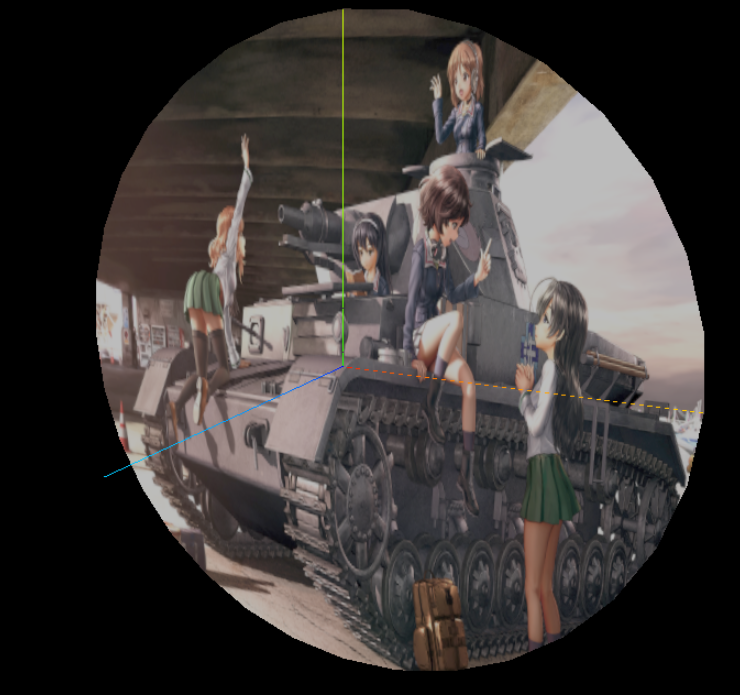

# UV贴图

## 核心思路

1. **定义 UV 坐标数组**  
   通过 `Float32Array` 创建一个长度为顶点数 × 2 的数组，每两个一组代表一个顶点的 UV 坐标（u, v）。  
   - `u` 对应纹理宽度方向，取值范围 [0, 1]  
   - `v` 对应纹理高度方向，取值范围 [0, 1]  

2. **将 UV 数据传入几何体**  
   利用 `THREE.BufferAttribute` 将上一步的 UV 数组包装成 Attribute，并挂载到 `geometry.attributes.uv` 上。

3. **加载纹理并赋给材质**  
   使用 `THREE.TextureLoader` 加载贴图（例如 `'/earth.jpg'`），得到一个 `THREE.Texture` 对象，再将其赋值给 `MeshLambertMaterial` 的 `map` 属性。

4. **渲染时引擎自动根据 UV 坐标将纹理展开到对应的三角面上**  
   - 顶点位置 → UV 坐标 → 片元着色器在纹理图上的采样坐标  
   - GPU 根据插值将每个片元投射到正确的纹理位置，最终将贴图渲染到模型表面

---

## 关键代码示例

```js
// 1. 定义几何体顶点位置（已省略）
// const vertices = new Float32Array([ ... ]);
// geometry.attributes.position = new THREE.BufferAttribute(vertices, 3);

// 2. 定义顶点索引（已省略）
// const indexes = new Uint16Array([ ... ]);
// geometry.index = new THREE.BufferAttribute(indexes, 1);

// 3. 创建 UV 坐标数组
//    注：这里定义了 4 个顶点的 UV 坐标，
//    每两个值 (u, v) 对应一个顶点，范围 0~1。
const uvs = new Float32Array([
  0, 0,   // 顶点 0 → 贴图左下角
  1, 0,   // 顶点 1 → 贴图右下角
  1, 1,   // 顶点 2 → 贴图右上角
  0, 1    // 顶点 3 → 贴图左上角
]);

// 4. 将 UV 数据包装成 BufferAttribute，并挂载到几何体
//    第二个参数 “2” 表示每 2 个 Float32 组成一个 UV 坐标 (u, v)
geometry.attributes.uv = new THREE.BufferAttribute(uvs, 2);

// 5. 加载纹理贴图
const textureLoader = new THREE.TextureLoader();
const texture = textureLoader.load('/earth.jpg');

// 6. 创建带贴图的材质
//    map 属性指定了要用的纹理对象，
//    Three.js 根据之前挂载的 UV 坐标，
//    自动把 texture 映射到每个三角面片上。
const material = new THREE.MeshLambertMaterial({
  map: texture
});

// 7. 最终创建网格并渲染（已省略）
// const mesh = new THREE.Mesh(geometry, material);
// scene.add(mesh);
```

## 解析与要点

1. **UV 坐标的定义**
   - `Float32Array([ 0, 0,  1, 0,  1, 1,  0, 1 ])`
     - 第 1 个顶点 `(0, 0)`：对应贴图左下角
     - 第 2 个顶点 `(1, 0)`：对应贴图右下角
     - 第 3 个顶点 `(1, 1)`：对应贴图右上角
     - 第 4 个顶点 `(0, 1)`：对应贴图左上角
   - UV 坐标范围为 **0 到 1**，分别映射到纹理的横纵比例位置。
2. **BufferAttribute 的使用**

```js
geometry.attributes.uv = new THREE.BufferAttribute(uvs, 2);
```

- 第一个参数 `uvs` 是上一步准备好的 `Float32Array`；
- 第二个参数 `2` 告诉 Three.js ，“每 2 个浮点数为一组”，对应一个顶点的 `(u, v)`。


3. **纹理加载与材质绑定**

```js
const texture = textureLoader.load('/earth.jpg');
const material = new THREE.MeshLambertMaterial({ map: texture });
```

- `textureLoader.load(url)` 会返回一个 `THREE.Texture` 对象；
- 将该对象赋给 `MeshLambertMaterial` 的 `map` 属性后，渲染阶段会自动将贴图与 UV 对应关系传给 GPU，进行采样与绘制。


4. **渲染流程概要**

- 顶点阶段：Three.js 会将 `position` 和 `uv` 一并传递给顶点着色器。
- 光栅化阶段：GPU 会对三角形内部进行插值计算，将每个片元的 UV 坐标算出。
- 片元阶段：片元着色器通过 UV 坐标去采样 `map` 纹理，把对应像素颜色输出到屏幕。

5. **注意事项**

- 若 UV 坐标超出 [0,1] 范围，可通过 `texture.wrapS = texture.wrapT = THREE.RepeatWrapping` 实现平铺；
- 若需要更精细的贴图控制，可在顶点数据中自定义不同的 UV 坐标（非矩形展开），实现局部或特殊区域贴图。

## uv坐标的自动裁剪

```js
import * as THREE from 'three'

const geometry=new THREE.CircleGeometry(100,32)
console.log('uv',geometry.attributes.uv);

// 纹理贴图加载器TextureLoader
const textLoader=new THREE.TextureLoader()
// .load()方法加载图像，返回一个纹理对象Texture
const texture=textLoader.load('/436853.jpg')

const material=new THREE.MeshLambertMaterial({
  // 设置贴图
  map:texture
})

const mesh=new THREE.Mesh(geometry,material)

export default mesh

```

ThreeJS会自动舍弃掉不在uv坐标坐标之内的贴图，只保留当前范围之内的贴图，也就是说它不会尽力把贴图的全部展示到几何体的范围之中，而是会自动裁剪。




# uv阵列的实现

## 实现思路

1. **加载纹理**  
   ```js
   const texture = textLoader.load('/image.png');

- `TextureLoader.load()` 会异步加载一张图片，并返回一个 `THREE.Texture` 对象。
- 默认情况下，Three.js 会把这张纹理只绘制在 UV 坐标 `[0,1] × [0,1]` 范围内，不会重复。

2. **设置纹理的环绕方式（Wrapping）**

   ```js
   texture.wrapS = THREE.RepeatWrapping;
   texture.wrapT = THREE.RepeatWrapping;
   ```

- `wrapS` 控制纹理在 **横向（U 方向）** 超出 `[0,1]` 时的表现；
- `wrapT` 控制纹理在 **纵向（V 方向）** 超出 `[0,1]` 时的表现；
- `THREE.RepeatWrapping` 表示“重复环绕”，即当 UV 坐标超出区间时，纹理会循环平铺。

> **常见的几个 wrap 模式**
>
> - `ClampToEdgeWrapping`（默认值）：超出部分截断到边缘像素，不会平铺。
> - `RepeatWrapping`：超出部分 → 重复（平铺）。
> - `MirroredRepeatWrapping`：超出部分 → 镜像翻转后重复。

3. **设置重复次数（Repeat）**

```js
texture.repeat.set(12, 12);
```

- `texture.repeat` 是一个 `Vector2`，其中 `.x` 对应 U 方向的重复倍率，`.y` 对应 V 方向的重复倍率。
- `.set(12, 12)` 意味着把原本只映射一次（UV = 0→1 范围）的纹理，改成在 U 方向重复 12 次、在 V 方向也重复 12 次。
- 结合了上一步的 `RepeatWrapping`，这时所有 UV 在 `[0,1]` 范围内的顶点会把这张图片循环平铺成 12×12 的阵列。

4. **创建带贴图的材质**

```js
const material = new THREE.MeshLambertMaterial({
  map: texture
});

```

- map: texture 将我们配置好环绕和重复属性的纹理传给材质。
- 渲染时，三角形片元采样 UV 坐标，通过 UV → 纹理像素映射（`texture.repeat` + `wrap`），自动把图片平铺到几何体表面。

## 为什么会出现 UV 超过 `[0,1]` 的情况？

确实，**在大多数几何体（如 `PlaneGeometry`、`BoxGeometry` 等）里，原始的 UV 坐标默认都是落在 `[0,1] × [0,1]` 范围内**。也就是说，几何体的每个顶点 UV（u, v）一般都是 0–1 之间的数值。但在下面两种常见场景下，UV 会被“放大”或“拉伸”到大于 1 的区域，此时就会触发 `wrapS`（和/或 `wrapT`）的效果：

---

### 使用 `texture.repeat.set(...)` 放大 UV

当你这样写：

```js
texture.wrapS = THREE.RepeatWrapping;
texture.wrapT = THREE.RepeatWrapping;

// 让纹理在 U 方向和 V 方向都重复 12 次
texture.repeat.set(12, 12);
```

这段代码背后的本质是：

- Three.js 会在内部把**所有传给 GPU 的 UV 坐标都先乘以 `(repeat.x, repeat.y)`**。
- 假设原本某个顶点的 UV 是 `(0.5, 0.25)`，在调用 `texture.repeat.set(12, 12)` 后，实际上传给着色器的 UV 会变成 `(0.5 * 12, 0.25 * 12) = (6, 3)`。
- **也就是说，虽然几何体本身 “写死” 的 UV 坐标仍然是 `[0–1]`，但贴图采样时会先把它放大到 `[0–12]` 的范围。**
- 一旦放大后得到的 UV ≥ 1，就会触发纹理 “超出部分” 的处理模式，这时就需要 `wrapS = RepeatWrapping`（横向）和 `wrapT = RepeatWrapping`（纵向）去决定“放大后超出范围如何表现”。

具体效果：

- **如果 `repeat.set(12, 12)`，当 UV 在 U 方向从 0 → 12 时，GPU 会对每个片元做类似 `fract(u)`（取小数部分），也就是把 `6.3` 转成 `0.3`，把 `11.8` 转成 `0.8`。**
- **最终就相当于：原本在 `[0–1]` 范围内的一张贴图，被“切成”12×12 的多个小块，循环平铺到几何面上。**

因此，虽然“原始几何 UV” 都在 0–1 之间，但是在贴图阶段做了放大，导致“真正用于采样”的 UV 会 >1，从而需要 `RepeatWrapping` 来控制超出 `[0,1]` 部分怎么处理。

### 手动为几何体写入 UV（超出 0–1）

如果自己定义 `BufferGeometry` 并手动写 UV 数据，也可能写出超过 `[0,1]` 的数值。例如：

```js
const uvs = new Float32Array([
  0, 0,
  2, 0,   // U=2 相当于放大两倍
  2, 2,   // U、V 都超过 1
  0, 2
]);
geometry.attributes.uv = new THREE.BufferAttribute(uvs, 2);
```

- 这时候，因为你直接给了 UV 超过 1 的值（例如 U=2，V=2），GPU 采样时也是会去判断“超过 1 的那部分”怎么处理，就需要 `wrapS`／`wrapT` 来指定。
- 如果你写了 `wrapS = ClampToEdgeWrapping`，就会把 `u > 1` 的所有片元都“钳制”到 `u = 1`，导致贴图边缘像素被拉伸；
- 如果你写 `wrapS = RepeatWrapping`，就会把 `u = 1.3` 转成 `0.3` 去循环采样，得出平铺效果；
- 这说明不只是 `repeat.set(...)`，只要 UV 本身超过 `[0,1]`，就会用到 `wrapS`／`wrapT`。

### 为什么默认情况下「看起来」似乎并不会超过 0–1？

- **几何体自带的 UV**：内置几何体（Plane、Box、Sphere……）默认 UV 都在 0–1，所以如果你不去修改 `texture.repeat`、也不手动写 UV，就永远只在 `[0,1]` 里。此时即使不写任何 `wrapS`、`wrapT`，也看不到“重复”效果，因为 UV 根本没超区间。
- **没有设置 `texture.repeat.set(...)`**：如果没有 call `texture.repeat.set(x, y)`，就等同于 `texture.repeat = (1, 1)`，那么即便 `wrapS = RepeatWrapping`，也没起到“拉伸 UV”的作用——UV 还是都在 0–1，所以采样时没“超区间”可处理。

只有当你显式让 UV “放大”到大于 1（两种方式：调用 `texture.repeat` 或者手动写 UV 数组超出 0–1），才会出现 “UV 超过 [0,1]” 的状态，进而需要 `wrapS`／`wrapT` 决定“超出部分怎么取值”。

### 总结

- **正常几何体的 UV：** 默认在 `[0,1] × [0,1]`，此时不会超区间，看不到 “重复” 效果。
- **调用 `texture.repeat.set(a, b)`：** 会把原本 0–1 的 UV “放大”到 `0–a`、`0–b`，从而实际传给 GPU 的 UV 就 >1；
- **手动写 UV 数组：** 也可能直接写成 >1 的值，同样触发超区间。
- **`wrapS` 作用：** 控制“当 U 坐标（横向）超出 [0,1] 后，该怎么处理”（重复、钳制、镜像），`wrapT` 对应 V（纵向）超出后的处理。

所以，虽然“几何体的内置 UV” 默认都在 [0,1] 内，但在实际贴图过程中，经常会用 `texture.repeat` 来让 UV 超出 1，这时就必须给 `wrapS`/`wrapT` 指定合适的模式，才能得到想要的平铺或镜像效果。

## 关键知识点

1. **UV 坐标基础**
   - 所有几何体（如 `PlaneGeometry`、`BoxGeometry` 等）都会生成一套默认的 UV 坐标，范围通常在 `[0,1] × [0,1]`。
   - UV 坐标决定了纹理上 “哪个像素” 对应到模型的 “哪个顶点／片元”。
2. **Wrapping（环绕模式）**
   - 当 UV 坐标 **超出** `[0,1]` 时，需要指定如何处理：
     - `ClampToEdgeWrapping`：超出会被“钳制”到 0 或 1，也就是无限拉伸边缘颜色；
     - `RepeatWrapping`：超出部分回到 UV 范围内，形成重复平铺；
     - `MirroredRepeatWrapping`：超出部分回到 UV 范围内时还会翻转贴图。
   - 只有当 `wrapS` 或 `wrapT` 设置为 `RepeatWrapping` （或 `MirroredRepeatWrapping`）时，`texture.repeat` 的值才会实际生效，否则超出部分会被“钳制”。
3. **repeat.set(uRepeat, vRepeat)**
   - `uRepeat = 12`：表示在 U 方向上，原始的 `[0 → 1]` 变成 `[0 → 12]`。
   - `vRepeat = 12`：表示在 V 方向上，原始的 `[0 → 1]` 变成 `[0 → 12]`。
   - 最终实际绘制时，GPU 会把每个片元的 UV 取值 mod 1（若为 `RepeatWrapping`），因此会在宽高上形成 12 列 × 12 行的贴图网格。
4. **材质和渲染流程**
   - 在顶点着色器阶段，Three.js 会把每个顶点的 UV 坐标传递下去。
   - 在片元着色器阶段，根据插值算出的 UV，去纹理 (`map: texture`) 中采样。
   - 最终每个像素的颜色 = 采样到的纹理像素值。因为我们在 UV 范围之外依然允许“重复平铺”，所以贴图会不断循环，形成阵列效果。
5. **应用场景**
   - **大平面/地面**：将一小张贴图（如地砖、草地纹理）反复平铺，避免使用超大分辨率纹理，却还能获得高细节效果。
   - **墙体、顶棚**：类似地，重复图像可节约显存与带宽，同时保证纹理清晰。
   - **可配合自定义 UV**：若自定义模型的 UV 坐标范围不在 `[0,1]`，也能通过 `RepeatWrapping` 强行平铺多次。
